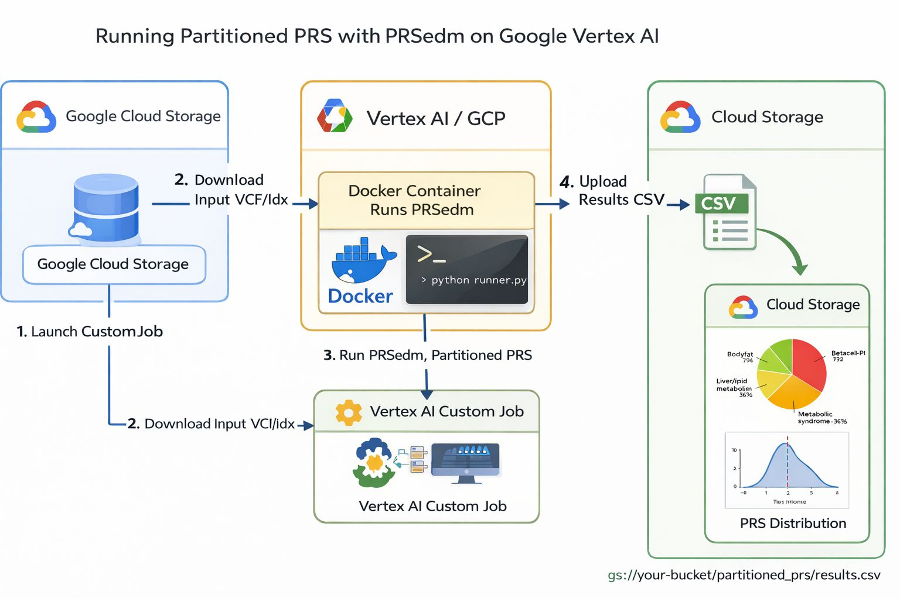
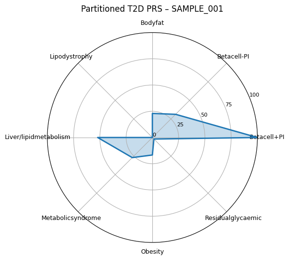
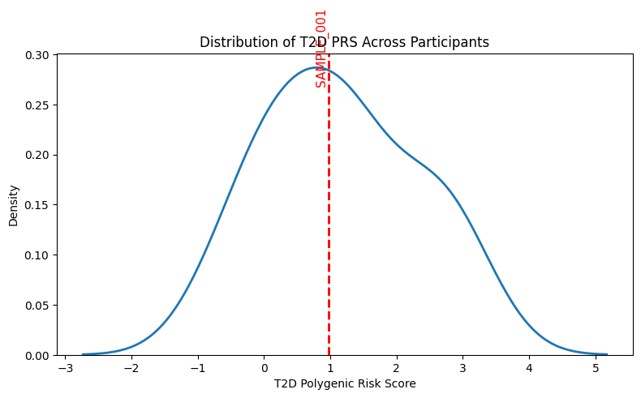
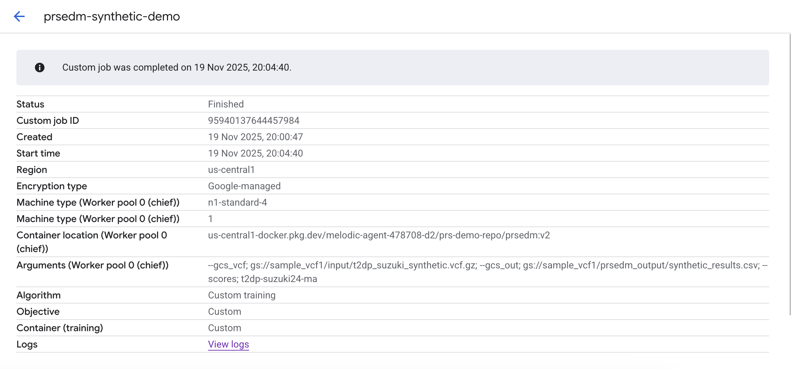

# Partitioned Polygenic Risk Scores on Vertex AI using PRSedm

**Author: Kezia Irene**

This repository demonstrates how to run **partitioned polygenic risk scores (PRS)** using **PRSedm** on **Google Cloud Vertex AI**.

The pipeline computes both a total PRS and biologically partitioned components from VCF inputs, allowing genetic risk to be interpreted in terms of underlying biological pathways rather than as a single aggregate score.

---

## Background

Many common diseases, including Type 2 Diabetes (T2D), are highly polygenic. Standard PRS methods summarise genetic risk into one number, which is useful for stratification but limited in interpretability.

Partitioned PRS extends this idea by decomposing the total score into biologically meaningful components, such as beta-cell function, obesity-related pathways, and lipid metabolism. This makes it possible to compare individuals with similar diagnoses but different underlying genetic drivers, and to better understand disease heterogeneity.

This repository focuses on the **practical execution** of partitioned PRS in a scalable and reproducible way, rather than on score construction itself.

---

## What this repository contains

The repository includes:

* A Docker image for running PRSedm in a cloud environment
* A Vertex AI CustomJob configuration for executing PRSedm on Google Cloud
* An example notebook showing how to run the pipeline end to end
* Example visualisations of partitioned PRS outputs

The code is organised so that the Docker, cloud execution, and analysis steps are clearly separated.

---

## Pipeline overview


At a high level, the workflow is as follows:

1. A bgzipped and indexed VCF is stored in Google Cloud Storage
2. Vertex AI launches a CustomJob using a user-defined Docker image
3. The container downloads the VCF and runs PRSedm
4. Partitioned and total PRS are computed
5. Results are written back to Cloud Storage as a CSV file

The figure below shows the overall execution flow.

---

## Repository structure

```text
partitioned-prs-vertexai/
│
├── README.md
├── notebooks/
│   └── 01_partitioned_prs_vertexai.ipynb
│
├── docker/
│   ├── Dockerfile
│   └── runner.py
│
├── vertex/
│   └── submit_prsedm_job.py
│
├── examples/
│   └── sample_vcf_paths.md
│
├── diagrams/
│   ├── prsedm_vertex_flow.png
│   ├── partitioned_prs_radar_sample001.png
│   └── t2d_prs_distribution_sample001.png
│   └── vertex_ai_custom_job_success.png
│
└── LICENSE
```

---

## Example outputs

The pipeline produces a CSV with one row per individual, containing both the total PRS and the partition-level scores.

### Partitioned PRS for a single individual

The radar plot below shows the partitioned T2D PRS for one individual, highlighting the relative contribution of different biological components to overall genetic risk.



---

### Total PRS in population context

Total PRS values are typically interpreted relative to a reference population. The figure below shows the distribution of total T2D PRS across participants, with one individual highlighted.



---


## Vertex AI execution

PRSedm is executed as a Vertex AI CustomJob using a user-defined Docker image.
When the pipeline completes successfully, the job appears in the Vertex AI console
with full metadata, including container image, input arguments, region, and logs.

An example completed job is shown below.




The job runs a single worker that downloads the input VCF from Cloud Storage,
executes PRSedm with the specified score set, and writes the resulting PRS CSV
back to Cloud Storage.


## Requirements

To run this pipeline, you will need:

* A Google Cloud project with billing enabled
* Vertex AI API enabled
* The `gcloud` CLI configured locally
* A bgzipped VCF (`.vcf.gz`) and corresponding Tabix index (`.tbi`) stored in Google Cloud Storage

No genomic data are included in this repository.

---

## Notes

This repository is intended for research and methodological demonstration purposes.
It is not intended for clinical use.


